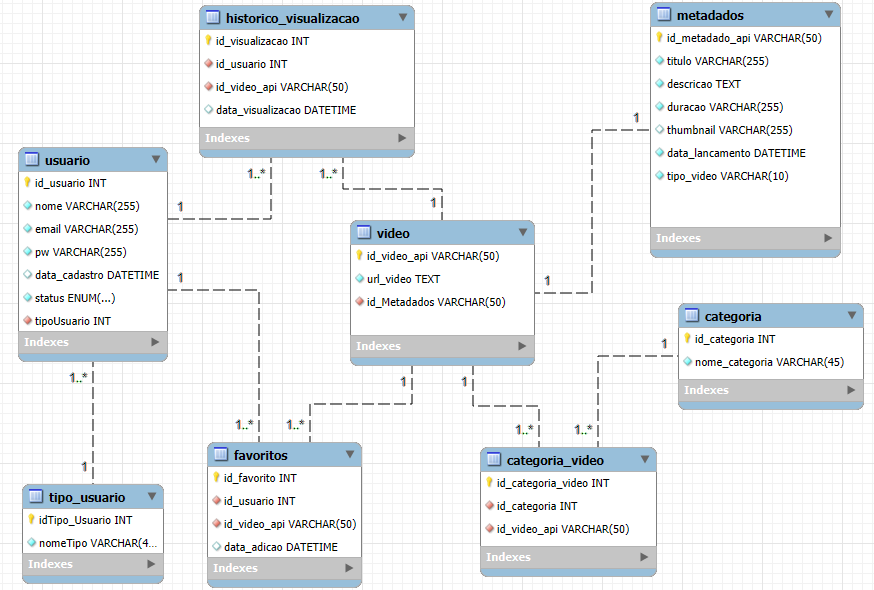

# 🎬 CanetaFlix - Plataforma de Streaming - **Em Desenvolvimento**

## 📌 Descrição

CanetaFlix é um serviço básico de streaming desenvolvido para a disciplina de **Sistemas Distribuídos**. O sistema adota a **arquitetura de microserviços**, onde cada serviço é responsável por uma parte da aplicação. O back-end (API RESTful) é construído em **Node.js com Express.js**, e o front-end se comunica com a API RESTful para acessar os vídeos.

## 🏗️ Arquitetura do Sistema

O sistema segue um modelo de **API RESTful**, onde:

- O **front-end** requisita os dados ao **back-end**.
- O **back-end (API RESTful)** consulta o banco de dados MySQL e retorna as informações.
- A **API de vídeos** é consultada somente quando o back-end precisa renderizar o conteúdo no front-end.
- A **API de metadados** é consultada uma vez por dia para atualizar o banco de dados com novos vídeos.
- Há uma função que compara os **IDs dos vídeos da API de vídeos com o banco de dados**. Se existirem novos vídeos, eles são buscados na API de metadados e salvos no banco.
- A **URL do vídeo** é montada no momento em que os metadados são salvos, pois a API de vídeos exige apenas o ID para filmes.

## 🖼️ Diagrama de Componentes


## 🗂️ Estrutura de Pastas

```
CanetaFlix/
├── canetaFlixAPI/         # Back-end (API RESTful)
│   ├── src/
│   │   ├── controllers/   # Lógica das rotas
│   │   ├── models/        # Interação com o banco de dados
│   │   ├── routes/        # Definição das rotas
│   │   ├── services/      # Serviços auxiliares (integração com APIs externas)
│   │   ├── config/        # Configuração do banco de dados
│   │   ├── utils/         # Funções auxiliares (ex: montar URL)
│   │   ├── jobs/          # Agendamentos (ex: atualização diária)
│   │   ├── app.js         # Configuração principal do Express
│   ├── database/          # Banco de Dados
│   │   ├── DBcanetaFlix.sql   # Script SQL com estrutura do banco
│   │   ├── seedDatabasae.js   # Script para popular o banco
│   ├── .env               # Configuração de variáveis de ambiente
│   ├── .gitignore         # Arquivos a serem ignorados pelo Git
│   ├── package.json       # Configuração do projeto
│   ├── server.js          # Arquivo principal para rodar a API

├── canetaFlixClient/       # Front-end (HTML, CSS, JS)
│   ├── index.html         # Página principal
│   ├── assets/            # Imagens e ícones
│   ├   ├── css/               # Estilos
│   ├   ├── js/                # Scripts
│   ├   ├── imgs/                # Imagens do Projeto

├── doc/                   # Documentação do projeto
│   │   ├── DiagramaComponentes_CanetaFlix  # Diagrama de componentes
│   │   ├── DVP_CanetaFlix                  # Documento de Visão do Projeto
```

## 🛠️ Tecnologias Utilizadas

### 📌 Back-End (API RESTful)

- **Node.js** + **Express.js**
- **MySQL** (Banco de Dados)
- **Node-Cron** (Agendamento de tarefas diárias)
- **Dotenv** (Gerenciamento de variáveis de ambiente)
- **Cors** (Permitir comunicação entre front-end e back-end)
- **JsonWebToken (JWT)** (Autenticação de usuários)
- **Bcrypt** (Hash de senhas para maior segurança)

### 📌 Front-End

- **HTML, CSS e JavaScript puro**
- **Fetch API** para comunicação com o back-end

## 🗄️ Banco de Dados



O banco de dados utilizado é o **MySQL**. A estrutura das tabelas pode ser vista no script SQL disponível na pasta `canetaFlixAPI/database/DBcanetaFlix.sql`.

### 📍 Estrutura Principal

- **usuarios** → Armazena informações de usuários com senhas hashadas (bcrypt).
- **videos** → Contém informações dos vídeos disponíveis na plataforma.
- **metadados** → Armazena os metadados dos vídeos coletados da API externa.
- **historico** → Registra os vídeos assistidos pelos usuários.
- **favoritos** → Gerencia a lista de vídeos favoritos dos usuários.

💡 *Exemplo de script SQL para criar as tabelas está disponível em **`canetaFlixAPI/database/DBcanetaFlix.sql`**.*

## 🚀 Como Rodar o Projeto

### Crie uma conta e obtenha sua chave de API do TMDB, é facii e gratuito. Toda a informação nescessaria de como fazer no [Site Oficial do TMDB](https://developer.themoviedb.org/docs/getting-started)

### 🔹 1. Clone o Repositório

```sh
git clone https://github.com/seu-usuario/canetaFlix.git
cd CanetaFlix
```

### 🔹 2. Instale as Dependências

```sh
cd canetaFlixAPI
npm install express mysql2 dotenv node-cron cors jsonwebtoken bcrypt
```

### 🔹 3. Configure o Banco de Dados

Crie um arquivo **.env** na raiz do projeto e adicione:

```env
PORT=3000
API_KEY=sua_chaveDaApi_TMDB
DB_HOST=seu_host
DB_USER=seu_usuario
DB_PASS=sua_senha
DB_NAME=seu_banco
JWT_SECRET=sua_chave_secreta
```

### 🔹 4. Inicie o Servidor

```sh
node server.js
```

Agora, a API estará rodando em `http://localhost:3000`

## 📡 Rotas da API

### 📍 **Vídeos**

- `GET /api/videos/filmes` → Retorna a lista de vídeos
- `GET /api/videos/filmes/:id` → Retorna detalhes de um vídeo específico

### 📍 **Metadados**

- `POST /api/metadados/sincronizar` → Atualiza os metadados da API externa

### 📍 **Histórico**

- `GET /api/usuario/historico` → Retorna o histórico de vídeos assistidos
- `POST /api/usuario/historico` → Registra um novo vídeo assistido

### 📍 **Favoritos**

- `GET /api/usuario/favoritos` → Lista vídeos favoritos do usuário
- `POST /api/usuario/sfavoritos` → Adiciona um vídeo aos favoritos

### 📍 **Autenticação de Usuários**

- `POST /api/usuario/registro` → Cria um novo usuário com senha criptografada
- `POST /api/usuario/login` → Autentica um usuário e retorna um token JWT

## 📅 Atualização Automática de Metadados

A API de metadados é consultada **uma vez por dia** para atualizar o banco de dados com novos vídeos. Esse processo é feito por um **cron job** configurado no arquivo `src/jobs/metadadosJob.js`.

## 📌 Considerações Finais

Este projeto está em desenvolvimento para a disciplina de **Sistemas Distribuídos**, demonstrando o uso de **APIs RESTful, integração com serviços externos, autenticação JWT e banco de dados MySQL**.
